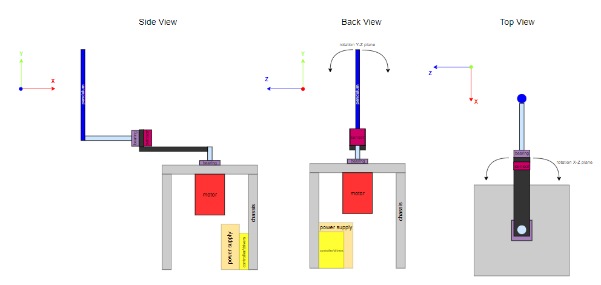
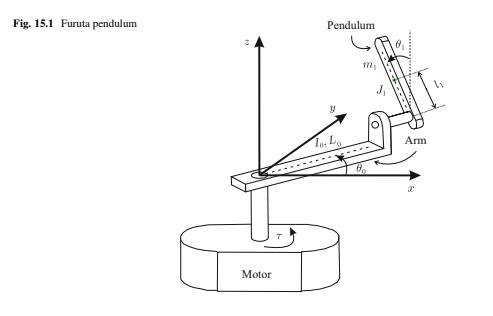
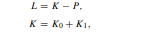
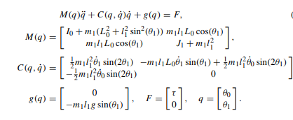
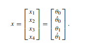
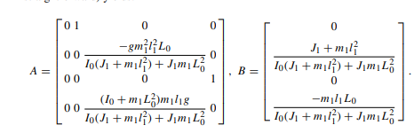

# Furuta Pendulum
## MECA 482-01 Group 2
Aaron Fawcett, Alexander Hernandez, Nancy Padilla, Dylan Sanders, Marius Van Zyl 
## Table of Contents
1. Introduction
2. System Requirements
3. Model
4. Controller and Design Simulations
5. Results
6. References
## Background

The "Furuta Pendulum" is a sytem of two arms linked together controlled by one motor. The first arm rotates in a horizontal plane and the second arm rotates in a vertical plane at the end of the first arm. A motor is attached to one end of the first arm while the second arm is attached to the other end. The second arm rotates freely about its rotation plane. A Furuta Pendulm can be seen in the figure below.

<p align="center">
  
</p>

The goal is to balance the second arm in an upwards vertical position. To acheive this, control methods must be developed, tested and implemented. A mathematical model is devloped in MATLAB using the methods developed by Hernández-Guzmán (870). The model is simulated in CoppeliaSim to verify its success.


## System Requirements

* Must keep pendulum within 90 degrees from vertical
* Must be able to be disturbed and self-correct

<p align="center">
  
</p>

<h3 align="center">Operational Viewpoint for the Furuta Pendulum</h3>


<p align="center">
  
</p>

## Model

  In order to model the Furuta Pendulum, a schematic was use to derive the mathematical model.The reference axes and the system variable is define by the figure below. The mathematical model for the this system is obtained by using the Euler Lagrangian equations. 
<p align="center">
  
</p>

The following parameters are obtained based on the schematic above and the parametersare used in the derivation of the mathematical model. 

* g is the acceleration due to gravity 
* m1 is the pendulum mass
* θo is the angular position of the arm in radians
* θ1 is the angular position of the pendulum with respect to the pendulum in the downward position, in radians.
*  τ is the torque generated by the electric motor that is applied to the arm.
*  I0 is the arm inertia when it rotates around one of its ends plus the motor inertia.
*  L0 is the arm length.
*  l1 is the location of the center mass of the pendulum.
*  J1 is the moment of inertia

2. Equation of Motion 

<p align="center">
  
</p>
 
 For the system total kinetic energy is the summation of the kintic energy of the pendulum arm rotating, as well as the kintic enegy rotating.The equation shown above are the general definition for the given system. 
                                                                                                                                  
Next, the Kinetic energy for the body is the translational movement of the body's center of mass and the rotative movement of a beam around an axis passing through the pendulum center. The equation below define the systems total kinetic energy.
                                                                                                                                                      
<p align="center">
  
</p>
                                                                                                                                              
To compute the pendulum poential energy, θ1 is equal to zero, and its the reference point. The equation below is the potential energy equation. 
                                                                                                                                              
<p align="center">
  
</p>                  
                                                                                                                                                
The equation below is the representation of of the system mathematical model, which is nonlinear. 
                                                                                                                                                
<p align="center">
  
</p>
                                                                                                                                               
The next step is to write the Mathematical model in terms of state space representation. State space representation is found by definding the state x components as an unknown variable. Below shows the system variables in state space representation.
                                                                                                                                               
<p align="center">
  
</p>
                                                                                                            
Applying the prevoius equations,the relationship of the equations, it expression is define as a vector matrix state space eqation. the result is seen below. 
                                                                                                                                               
<p align="center">
  
</p>                                                                                                                                            
                                                                                                                                   
## Controller and Design Simulations
The simulation was achievied in CoppeliaSIM. The equation of motion is implemented into comppeliaSIM. The model is programmed using MATLAB and then the program is linked to CoppeliaSIM.                                     
## Results

<p align="center">
  
</p>

## Appendix
**MATLAB Code**
<details>
   <summary>Click to expand Furuta Pendulum main code.</summary>

```
clear all; close all; clc; clf;

% Reference figure
g = 9.81;     % m/s^2
l1 = 0.129;   % m
L0 = 0.1550;  % m
m1 = 0.02218; % Kg
J1 = 0.0001845;  % Kg-m^2
I0 = 0.00023849; % Kg-m^2

% 15.4 Differential Flattness Based Model, [Ortigoza] Automatic Control
a = (-g*(m1^2)*(l1^2)*L0)/(I0*(J1+m1*(l1^2))+(J1*m1*(L0^2)));
b = ((I0+m1*(L0^2))*m1*l1*g)/((I0*(J1+m1*(l1^2)))+J1*m1*(L0^2));
c = (J1+m1*(l1^2))/(I0*(J1+m1*(l1^2))+J1*m1*(L0^2));
d = (-m1*l1*L0)/(I0*(J1+m1*(l1^2))+J1*m1*(L0^2));

%Controlability Matrix
%C0 = [B A*B (A^2)*B (A^3)*B] Rank
C0 = [0 c 0 a*d; 
      c 0 a*d 0;
      0 d 0 b*d;
      d 0 b*d 0];
% derivative of C0 Controlability Matrix
dC0 = ((m1^4)*(l1^4)*(L0^2)*(g^2))/(((I0*(J1+m1*(l1^2))+J1*m1*(L0^2)))^4); 

%dabh is d*(a+b*h) Eq 15.9
dabh = ((g*((J1*I0)+(I0*m1*(l1^2))+(J1*m1*(L0^2))))/(L0*(I0*(J1+m1*(l1^2))+J1*m1*(L0^2))))*d;
h = (dabh-(a*d))/(d*b);

%Transformation function Eq 15.22
%YsDD_YdsDD = (Beta*dabh)./(s.^2 - dabh*kv.*s - (b+Beta*dabh));

%Set Parameters from Table 15.2
Beta = 0.0041; 
s = 0:0.005:0.5; 
kv = 2.3755*10^-4;
kd = 2.88;
kp = 2.88;

%Find Step Data Check against Table 15.2
num1 =Beta*dabh;
den1 = [1 -dabh*kv -(b+Beta*dabh)];
G1 = tf(num1, den1); 
x1 = step(G1,s); 
SI1 =stepinfo(G1);
disp('Step Info 1');
disp(SI1)

%Find Poles check against Table 15.2
poly = [1 (-dabh*kv) (-(b+Beta*dabh))];
S1 = roots(poly); 
disp('Poles 1'); 
disp(S1)

%Find the State Feedback Controller Gains Table 15.3
k1 = -Beta*kp;
k2 = -Beta*kd;
k3 = -(Beta*(a+(b*h))+Beta*kp*h);
k4 = -(kv*(a+(b*h))+Beta*kd*h);
disp('Controller Gains 1');
disp('    k1,       k2,       k3        k4')
K = [k1 k2 k3 k4];
disp(K)

plot(s,x1)

%Define system Matrices
A =[0 1 0 0; 
    0 0 ((-g*(m1^2)*(l1^2)*L0)/(I0*(J1+m1*(l1^2))+(J1*m1*(L0^2)))) 0;
    0 0 0 1;
    0 0 ((I0+m1*(L0^2))*m1*l1*g)/(I0*(J1+m1*(l1^2))+J1*m1*(L0^2)) 0];

B = [0; 
    ((J1+m1*(l1^2))/(I0*(J1+m1*(l1^2))+J1*m1*(L0^2))); 
    0; 
    (-m1*l1*L0)/(I0*(J1+m1*(l1^2))+J1*m1*(L0^2))];

C = eye(2,4);

D = zeros(size(C,1),size(B,2));

% Create State Space object
sys =ss(A,B,C,D);
%check open loop Eigenvalues
E = eig(A);

% Requirements Wn, zeta or Ts, Tp, Tr, %OS
%Given zeta, Wn
zeta = 0.9999;
wn = 10;
Tp = pi/(wn*sqrt(1-(zeta^2)));
Ts = 4/(zeta*wn);
Tr =0;
OS = exp(-(zeta*pi/sqrt(1-(zeta^2))))*100;
disp('% OverShoot');disp(OS)

%Given Ts, Tp, Tr, %OS30.9190
%OS = 30.9190;
%zeta = (-log(OS/100))/sqrt((pi^2)+(log(OS/100))^2);
%Tp = 
%Ts =
%Tr =0;

s1 = -zeta + 1i*wn*sqrt(1-zeta^2);
s2 = -zeta - 1i*wn*sqrt(1-zeta^2);

%Desired closed loop eigen values
P = [s1 s2 -20 -30];

%solve for K using pole placement (Not in phase variable form)
[numol, denol] = ss2tf(A,B,C,D);
[Acc, Bcc, Ccc, Dcc] = tf2ss(numol, denol); %(Control canonical form)

% Similarity transformation
P_= [ 0 0 0 1; 0 0 1 0; 0 1 0 0; 1 0 0 0];
Acor = inv(P_)*Acc*P_;
Bcor = inv(P_)*Bcc;
Ccor = Ccc.*P;
Dcor = Dcc;

K = place(Acc, Bcc, P); % acker

%Check for closed-loop Eigenvalue
Anew = Acc-Bcc*K;
Enew = eig(Anew);

%closed loop system
syscl = ss(Anew, Bcc, Ccc, Dcc)

% Step response of the system
step(syscl);

Kr = 1/dcgain(syscl);
Dcc = zeros(size(Ccc,1),size(Bcc*Kr,2));
syscl_scaled = ss(Anew, Bcc*Kr, Ccc, Dcc);
step(syscl)
step(syscl_scaled)

```
</details>

## References
Hernández-Guzmán, Victor Manuel, and Ramón Silva-Ortigoza. Automatic control with experiments. Cham, Switzerland: Springer, 2019.

Nise, N. S. (2011). Control Systems Engineering. John Wiley & Sons.

